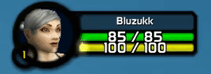

# Energy-Ticks Classic WoW

Display energy ticks in the energy bar.

Thanks to modernist ([modUI](https://github.com/obble/modui_classic))

## Installation

* Download ([here](https://github.com/bluzukk/EnergyTick/archive/master.zip))
* Unzip
* Rename folder to Energytick
* Move folder to Interface/Addons/

## Options

* Alpha for the ticks can be set for in-fight and normal.
* Use /et for information ingame

### Examples

* `/et fight 1.0` &nbsp;   &nbsp;   - Set in-fight alpha to 1.0
* `/et fight 0.5` &nbsp;   &nbsp;   - Set in-fight alpha to 0.5
* `/et normal 1.0` &nbsp;   - Set normal alpha to 1.0
* `/et normal 0.5` &nbsp;   - Set normal alpha to 0.5
